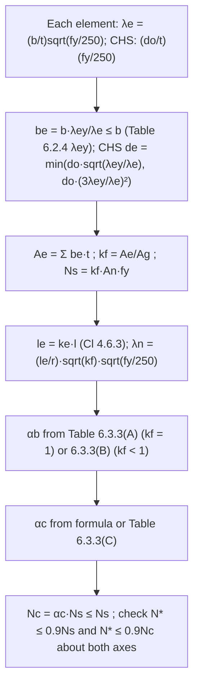

# Compression member section and member capacity

> Scope: AS 4100:2020 Cl 6.1–6.3 and 6.6 — `N_s = k_f A_n f_y` with form
> factor from element effective widths (Table 6.2.4), `N_c = α_c N_s` with
> the member slenderness reduction factor `α_c` (formula and Table
> 6.3.3(C)), section constant `α_b` (Tables 6.3.3(A)/(B)), varying
> cross-sections, and restraint design forces. Laced, battened and
> back-to-back members are on [[steel-built-up-compression-members]].

## Summary

`[code]` A concentrically loaded compression member must satisfy both
`N* ≤ φN_s` and `N* ≤ φN_c` (Cl 6.1), `φ = 0.9`.

`[code]` `N_s = k_f A_n f_y` (Cl 6.2.1); `k_f = A_e/A_g` (Cl 6.2.2), with
`A_e` summed from element effective widths `b_e = b(λ_ey/λ_e) ≤ b`
(Cl 6.2.4). `N_c = α_c N_s ≤ N_s` (Cl 6.3.3) with `α_c` a function of the
modified slenderness `λ_n = (l_e/r)·sqrt(k_f)·sqrt(f_y/250)` and the section
constant `α_b`; `l_e = k_e l` (Cl 6.3.2).

## Detail

### Section capacity (Cl 6.2)

`[code]`
- `A_n` = net area, except that penetrations or unfilled holes reducing the
  area by less than `100{1 − [f_y/(0.85f_u)]}` % may be ignored (gross area);
  fastener hole deductions per Cl 9.1.10.
- Plate element slenderness (6.2.3): `λ_e = (b/t)·sqrt(f_y/250)`, `b` the
  clear outstand or clear width between supporting elements; CHS
  `λ_e = (d_o/t)(f_y/250)`.
- Effective width (6.2.4): `b_e = b(λ_ey/λ_e) ≤ b`; CHS effective diameter
  `d_e` = lesser of `d_o·sqrt(λ_ey/λ_e) ≤ d_o` and `d_o(3λ_ey/λ_e)²`.
  Alternatively `b_e = b(λ_ey/λ_e)·sqrt(k_b/k_bo) ≤ b` with `k_b` from a
  rational elastic buckling analysis of the whole member as a plate
  assemblage and `k_bo = 4.0` (both edges supported) or `0.425` (outstand).

`[code]` Table 6.2.4 — plate element yield slenderness limit `λ_ey`:

| Plate element | Edges supported | Residual stress | λ_ey |
|---|---|---|---|
| Flat | One (outstand) | SR | 16 |
| | | HR | 16 |
| | | LW, CF | 15 |
| | | HW | 14 |
| Flat | Both | SR | 45 |
| | | HR | 45 |
| | | LW, CF | 40 |
| | | HW | 35 |
| CHS | — | SR, HR, CF, LW, HW | 82 |

(SR stress relieved; HR hot-rolled/hot-finished; CF cold-formed; LW / HW
lightly / heavily welded longitudinally; welded members with compressive
residual stress < 40 MPa may be taken as LW.)

`[derived]` Most rolled UB/UC have `k_f = 1.0`; the deeper, thin-webbed UBs
(e.g. 610UB101, 530UB82) and many WB sections have `k_f < 1.0` because the
web `λ_e` exceeds 45. Section tables list `k_f` — use it rather than
assuming 1.0, because it also changes which `α_b` table applies.

### Member capacity — constant section (Cl 6.3)

`[code]` Definitions (6.3.1): geometrical slenderness ratio `l_e/r` with `r`
about the relevant axis on the **gross** section; length `l` = centre-to-
centre of intersections with supporting members, or the cantilevered length
for free-standing members. `l_e = k_e l` with `k_e` per Cl 4.6.3 (6.3.2) —
see [[steel-member-effective-length-and-frame-buckling]].

`[code]` `N_c = α_c N_s ≤ N_s` (6.3.3) where

- `α_c = ξ{1 − sqrt[1 − (90/(ξλ))²]}`
- `ξ = [(λ/90)² + 1 + η] / [2(λ/90)²]`
- `λ = λ_n + α_a α_b`
- `η = 0.00326(λ − 13.5) ≥ 0`
- `λ_n = (l_e/r)·sqrt(k_f)·sqrt(f_y/250)`
- `α_a = 2100(λ_n − 13.5) / (λ_n² − 15.3λ_n + 2050)`
- `α_b` from Table 6.3.3(A) (`k_f = 1.0`) or 6.3.3(B) (`k_f < 1.0`).

Alternatively read `α_c` directly from Table 6.3.3(C) with `λ_n` and `α_b`.

`[code]` Fabricated monosymmetric and non-symmetric sections (other than
unlipped angles, tees and cruciforms) and hot-rolled channels braced about
the minor principal axis must also be checked for **flexural-torsional
buckling to AS/NZS 4600**, with a 0.85 reduction factor on `N_c` and
`φ = 0.90`.

`[code]` Table 6.3.3(A) — `α_b` for `k_f = 1.0`:

| α_b | Section description |
|---|---|
| −1.0 | Hot-formed RHS and CHS; cold-formed (stress relieved) RHS and CHS |
| −0.5 | Cold-formed (non-stress relieved) RHS and CHS; welded H, I and box sections from Grade 700 Q&T plate |
| 0 | Hot-rolled UB and UC (flange ≤ 40 mm); welded H and I from flame-cut plates; welded box sections |
| 0.5 | Tees flame-cut from universal sections, and angles; hot-rolled channels; welded H and I from as-rolled plates (flange ≤ 40 mm); other sections not listed |
| 1.0 | Hot-rolled UB and UC (flange > 40 mm); welded H and I from as-rolled plates (flange > 40 mm) |

`[code]` Table 6.3.3(B) — `α_b` for `k_f < 1.0`:

| α_b | Section description |
|---|---|
| −0.5 | Hot-formed RHS and CHS; cold-formed RHS and CHS (stress relieved or not) |
| 0 | Hot-rolled UB and UC (flange ≤ 40 mm); welded box sections |
| 0.5 | Welded H and I sections (flange ≤ 40 mm) |
| 1.0 | Other sections not listed |

`[derived]` Australian AS/NZS 1163 RHS/SHS/CHS are cold-formed and not
stress relieved → `α_b = −0.5` (for `k_f = 1`). AS/NZS 3679.2 welded beams
and columns are made from as-rolled plate, so `α_b = 0.5` (flange ≤ 40) or
1.0 (flange > 40) — not 0 — unless the mill certifies flame-cut flanges.
Check the product data before choosing 0.

`[code]` Table 6.3.3(C) — `α_c` by `λ_n` and `α_b` (selected rows; full table
in the images below):

| λ_n | α_b = −1.0 | −0.5 | 0 | 0.5 | 1.0 |
|---|---|---|---|---|---|
| 10 | 1.000 | 1.000 | 1.000 | 1.000 | 1.000 |
| 20 | 1.000 | 0.989 | 0.978 | 0.967 | 0.956 |
| 30 | 0.991 | 0.968 | 0.943 | 0.917 | 0.888 |
| 40 | 0.973 | 0.940 | 0.905 | 0.865 | 0.818 |
| 50 | 0.944 | 0.905 | 0.861 | 0.808 | 0.747 |
| 60 | 0.907 | 0.862 | 0.809 | 0.746 | 0.676 |
| 70 | 0.861 | 0.809 | 0.748 | 0.680 | 0.609 |
| 80 | 0.805 | 0.746 | 0.681 | 0.612 | 0.545 |
| 90 | 0.737 | 0.675 | 0.610 | 0.547 | 0.487 |
| 100 | 0.661 | 0.600 | 0.541 | 0.485 | 0.435 |
| 110 | 0.584 | 0.528 | 0.477 | 0.431 | 0.389 |
| 120 | 0.510 | 0.463 | 0.421 | 0.383 | 0.348 |
| 130 | 0.445 | 0.406 | 0.372 | 0.341 | 0.313 |
| 140 | 0.389 | 0.357 | 0.330 | 0.304 | 0.282 |
| 150 | 0.341 | 0.316 | 0.293 | 0.273 | 0.255 |
| 160 | 0.301 | 0.281 | 0.263 | 0.246 | 0.231 |
| 180 | 0.239 | 0.225 | 0.213 | 0.202 | 0.192 |
| 200 | 0.194 | 0.185 | 0.176 | 0.168 | 0.161 |
| 250 | 0.124 | 0.120 | 0.116 | 0.113 | 0.110 |
| 300 | 0.086 | 0.084 | 0.082 | 0.081 | 0.079 |

![[as4100-table-6.3.3C-alpha-c-part1.png]]
![[as4100-table-6.3.3C-alpha-c-part2.png]]
![[as4100-table-6.3.3C-alpha-c-part3.png]]
*Table 6.3.3(C) — member slenderness reduction factor α_c, full table in three parts (AS 4100:2020, A1).*

### Member of varying cross-section (Cl 6.3.4)

`[code]` Use Cl 6.3.3 with `N_s` = the minimum section capacity along the
member and `λ_n = 90·sqrt(N_s/N_om)`, where `N_om` is the elastic flexural
buckling load from a rational elastic buckling analysis.

`[derived]` The same substitution `λ_n = 90·sqrt(N_s/N_om)` is a general
way to bring any buckling-analysis result (e.g. from STAAD/SAP2000
eigenvalue analysis) into the AS 4100 column curve for prismatic members
with unusual restraint; the standard only states it for varying sections.

### Restraints for compression members (Cl 6.6)

`[code]`
- Restraint systems (6.6.1): analyse the structure for its design loads
  including notional horizontal forces (Cl 3.2.4) from the points where
  the forces arise to anchorage/reaction points; design members and
  connections per 6.6.2 and 6.6.3.
- Restraining members and connections (6.6.2): at each restrained
  cross-section design for the greater of the 6.6.1 analysis force and
  **0.025 × the maximum axial compression in the member at that
  restraint**, except where restraints are closer than needed to make
  `N* = φN_c` — then group actual restraints into equivalent restraints that
  just achieve `N* = φN_c` and design each group for the force at its
  position.
- Parallel braced compression members (6.6.3): a line of restraints —
  each element designed for 0.025 × axial force in the connected member +
  0.0125 × sum of the axial forces in the members beyond, no more than
  seven members in the summation.

## Worked reference

`[derived]` Procedure check for a 200UC46.2 Grade 300 truss chord, `l = 3.0
m` between nodes in-plane and out-of-plane (`k_e = 1.0` per Cl 4.6.3.5):
`r_y = 51.0 mm`, `k_f = 1.0`, `f_y = 300` (flange 11 mm → 300 per Table
2.1 since 11 ≤ t ≤ 17): `λ_n = (3000/51.0)·1·sqrt(300/250) = 64.4`;
`α_b = 0` (hot-rolled UC, flange ≤ 40 mm); interpolate Table 6.3.3(C)
between 60 (0.809) and 65 (0.779) → `α_c ≈ 0.783`; `N_s = 5900 × 300 =
1770 kN`; `N_c ≈ 1386 kN`; `φN_c ≈ 1247 kN`. Section values illustrative —
verify against the section table.

## Contradictions

None recorded. **Flag**: the "λ_n = 20" row of Table 6.3.3(C) is
Amendment-No.-1-amended; the NCC's current reference edition of AS
4100:2020 is unamended and uses a slightly different row at `α_b = −0.5`
(former value 0.98, vs the current-edition value 0.989 shown in the table
above — all other entries in that row are unchanged). See
[[as-4100-2020-steel-structures]] "NCC compliance trap".

## Related

- [[steel-member-effective-length-and-frame-buckling]] — `k_e`, `N_om`.
- [[steel-built-up-compression-members]] — Cl 6.4, 6.5.
- [[steel-beam-section-moment-capacity]] — the bending analogue of element
  slenderness (Table 5.2).
- [[steel-combined-actions-section-capacity]] and
  [[steel-combined-actions-member-capacity]] — `N_s`, `N_c` feed Section 8.
- [[steel-web-shear-and-bearing]] and [[steel-web-stiffeners]] — bearing
  buckling and stiffener buckling use this clause with `α_b = 0.5`,
  `k_f = 1.0`.
- [[steel-beam-lateral-restraint]] — the bending analogue of the 2.5 %
  restraint rule.
- [[asi-design-capacity-tables-vol1-open-sections]] — Part 6 `φN_c` vs `L_e`
  design tables/graphs (1999, AS 4100-1998 vintage).
- [[asi-dct-vol1-compression-capacity-tables]] — full transcription of the
  Table 6-1 to 6-12 series (`φN_c` vs `L_e`, both axes, every open section),
  cross-checked against Cl 6.3.3 with zero discrepancies.

## Sources

- `raw/0-standards/AS_4100-2020-Reprinted-Cut.pdf`, Cl 6.1–6.3, 6.6
  (pp. 87–93, 98). Table 6.3.3(C) reproduced in `wiki/1-steelwork/assets/`
  (carries A1 amendment tags in the source).
