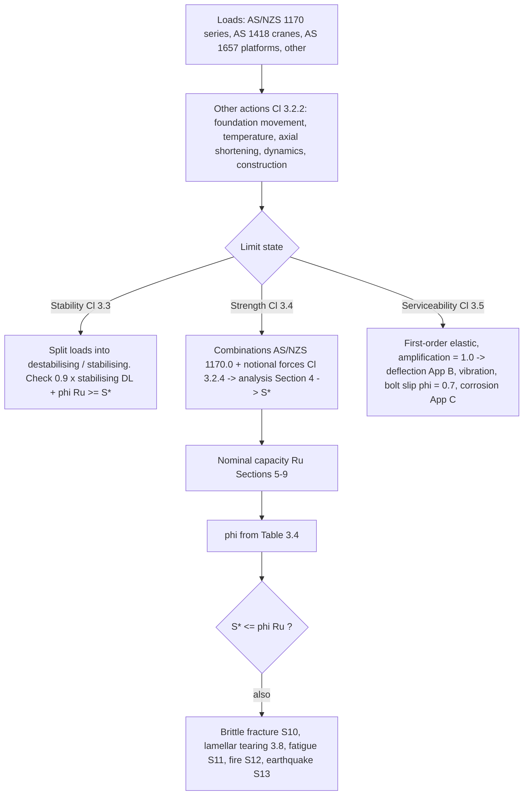

# Steel limit-state design basis and capacity factors

> Scope: AS 4100:2020 Section 3 — design aims, loads and other actions,
> load combinations, notional horizontal forces, robustness, the stability /
> strength / serviceability limit-state procedures, capacity factors
> (Table 3.4), and the routing clauses for load testing, brittle fracture,
> lamellar tearing, fatigue, fire and earthquake.

## Summary

`[code]` Every member and connection must satisfy `S* ≤ φR_u` for the
strength limit state (Cl 3.4(d)): design action effect from AS/NZS 1170.0
combinations and Section 4 analysis, versus nominal capacity from
Sections 5–9 multiplied by the Table 3.4 capacity factor.

`[code]` The structure must also satisfy stability (Cl 3.3), serviceability
(Cl 3.5), and — where relevant — brittle fracture (Section 10), lamellar
tearing (Cl 3.8), fatigue (Section 11), fire (Section 12) and earthquake
(AS 1170.4 + Section 13) requirements (Cl 3.1.2).

## Detail

### Design aims and requirements (Cl 3.1)

`[code]` Stable (no overturning, tilting or sliding over design life),
adequate strength and serviceable (acceptably low probability of failure or
loss of serviceability), durable (withstands wear and deterioration without
undue maintenance), and economical / constructible (Cl 3.1.1). Cl 3.1.2
lists the mandatory design checks: stability, strength, serviceability,
brittle fracture, lamellar tearing, fatigue, fire, earthquake.

### Loads and other actions (Cl 3.2)

`[code]` Loads (Cl 3.2.1): dead, live, wind, snow, ice and earthquake per
AS/NZS 1170.1, 1170.2, 1170.3 and AS 1170.4; crane loads per the AS 1418
series; fixed platforms, walkways, stairways and ladders per AS 1657; lifts
per AS 1735; other specific loads as required. Bridges use AS 5100.2.

`[code]` Other actions (Cl 3.2.2) that may significantly affect stability,
strength or serviceability must be included: foundation movements,
temperature changes and gradients, axial shortening, dynamic effects,
construction loading.

`[code]` Load combinations (Cl 3.2.3): AS/NZS 1170.0 for all three limit
states.

`[code]` Notional horizontal forces (Cl 3.2.4) — **multi-storey building
structures only**: at each floor apply a horizontal force of 0.002 × the
total design vertical load at that floor, acting with the AS/NZS 1170.1 dead
and live loads only, for strength and serviceability. Not applied for the
stability limit state.

`[derived]` Cl 3.2.4 is written for multi-storey buildings; whether to apply
an equivalent notional out-of-plumb force to multi-tier industrial
structures (transfer towers, conveyor gantry bents) is a judgement call not
governed by this clause. AS/NZS 5131 erection tolerances and the Cl 4.4.2
amplification approach are the alternatives to consider.

`[code]` Structural robustness (Cl 3.2.5): all steel structures, members and
connection components must conform to the AS/NZS 1170.0 robustness
requirements.

### Stability limit state (Cl 3.3)

`[code]` Procedure: (a) subdivide the Cl 3.2 loads into components tending to
cause instability and components tending to resist it; (b) design action
effect `S*` from the destabilising components using the AS/NZS 1170.0
strength combinations; (c) design resistance effect = 0.9 × the part of the
dead load resisting instability + `φR_u` of any resisting elements, with `φ`
from Table 3.4; (d) proportion so design resistance effect ≥ design action
effect.

### Strength limit state (Cl 3.4)

`[code]` (a) loads per Cl 3.2.1–3.2.2, strength design loads per
Cl 3.2.3–3.2.4; (b) `S*` from a Section 4 analysis; (c) `φR_u` with `R_u`
from Sections 5–9 and `φ` not exceeding Table 3.4; (d) `S* ≤ φR_u`.

### Table 3.4 — capacity factors φ for strength limit states

`[code]` Transcribed from Table 3.4 (AS 4100:2020):

| Design capacity for | Clauses | φ |
|---|---|---|
| **Member subject to bending** | | |
| — full lateral support | 5.1, 5.2, 5.3 | 0.90 |
| — segment without full lateral support | 5.1, 5.6 | 0.90 |
| — web in shear | 5.11, 5.12 | 0.90 |
| — web in bearing | 5.13 | 0.90 |
| — stiffener | 5.14, 5.15, 5.16 | 0.90 |
| **Member subject to axial compression** | | |
| — section capacity | 6.1, 6.2 | 0.90 |
| — member capacity | 6.1, 6.3 | 0.90 |
| **Member subject to axial tension** | 7.1, 7.2 | 0.90 |
| **Member subject to combined actions** | | |
| — section capacity | 8.3 | 0.90 |
| — member capacity | 8.4 | 0.90 |
| **Connection component other than a bolt, pin or weld** | 9.1.9(a)–(d) | 0.90 |
| | 9.1.9(e) | 0.75 |
| **Bolted connection** | | |
| — bolt in shear | 9.2.2.1 | 0.80 |
| — bolt in tension | 9.2.2.2 | 0.80 |
| — bolt subject to combined shear and tension | 9.2.2.3 | 0.80 |
| — ply in bearing | 9.2.2.4 | 0.90 |
| — bolt group | 9.3 | 0.80 |
| **Pin connection** | | |
| — pin in shear | 9.4.1 | 0.80 |
| — pin in bearing | 9.4.2 | 0.80 |
| — pin in bending | 9.4.3 | 0.80 |
| — ply in bearing | 9.4.4 | 0.90 |
| **Welded connection** | | SP / GP |
| — complete penetration butt weld | 9.6.2.7 | 0.90 / 0.60 |
| — longitudinal fillet weld in RHS (t < 3 mm) | 9.6.3.10 | 0.70 / — |
| — other fillet weld and incomplete penetration butt weld | 9.6.3.10 | 0.80 / 0.60 |
| — plug or slot weld | 9.6.4 | 0.80 / 0.60 |
| — weld group | 9.7 | 0.80 / 0.60 |

`[code]` SP and GP are the AS/NZS 1554.1 weld categories (structural purpose
/ general purpose). A GP weld carries a materially lower φ (0.60), which is
the design-side penalty for the reduced inspection and quality regime.

### Serviceability limit state (Cl 3.5)

`[code]` Control deflection, vibration, bolt slip and corrosion (Cl 3.5.1).
Method (Cl 3.5.2): loads per Cl 3.2.1–3.2.2, SLS combinations per
Cl 3.2.3–3.2.4; deflections by the **first-order elastic method of
Cl 4.4.2.1 with all amplification factors = 1.0**; vibration per Cl 3.5.4;
bolt slip per Cl 3.5.5; corrosion per Cl 3.5.6.

- **Deflection limits** (Cl 3.5.3): appropriate to the structure, its use,
  the loading and the supported elements. Suggested limits in Appendix B —
  see [[steel-deflection-limits]].
- **Vibration of beams** (Cl 3.5.4): beams supporting floors or machinery
  must be checked so machinery, vehicular or pedestrian vibration does not
  impair serviceability; where wind or machinery vibration is likely, prevent
  discomfort/alarm, damage or interference with function. AS 2670 covers
  human whole-body vibration exposure.
- **Bolt serviceability** (Cl 3.5.5): where slip must be avoided under SLS
  loads, select fasteners per Cl 9.1.6; for a friction-type connection in
  plane shear use `φ = 0.7` and design bolts per Cl 9.2.3.
- **Corrosion protection** (Cl 3.5.6): required where exposed to a corrosive
  environment; degree based on use, maintenance and climate/local
  conditions. Guidance in Appendix C; surface preparation and application
  per AS/NZS 5131. **The design basis makes no allowance for loss of
  material to corrosion** (Note 3). No corrosion allowance is needed in
  corrosivity categories C1 and C2 with coatings to AS 2312.1 or hot-dip
  galvanizing to AS/NZS 4680 with AS/NZS 2312.2 details; C3–CX need
  professional advice on coating system and maintenance strategy (Note 4).
  Weathering steel is outside AS 4100 — use AS/NZS 5100.6 (Note 6).

### Routing clauses (Cl 3.6–3.13)

`[code]`
- Cl 3.6 — strength/serviceability may alternatively be established by
  load testing to Section 17; Cl 3.7–3.11 still apply. See
  [[steel-load-testing]].
- Cl 3.7 — brittle fracture: parent material selection per Section 10. See
  [[steel-brittle-fracture-material-selection]].
- Cl 3.8 — lamellar tearing: see [[steel-materials-and-design-strengths]].
- Cl 3.9 — fatigue per Section 11: [[steel-fatigue-design]].
- Cl 3.10 — fire per Section 12: [[steel-fire-design]].
- Cl 3.11 — earthquake per AS 1170.4 and Section 13:
  [[steel-earthquake-design-requirements]].
- Cl 3.12 — other requirements (differential settlement, progressive
  collapse, special performance) to be designed for on the Standard's
  principles; bridge flood/collision loads per AS 5100.2.
- Cl 3.13 — reliability management: construction category selection per
  Appendix L; differing reliability levels achieved through quality
  management per AS/NZS 5131 and AS 5104 (ISO 2394).

## Worked reference

None yet.

## Contradictions

None recorded.

## Related

- [[as-4100-2020-steel-structures]] — standard register.
- [[steel-structural-analysis-methods]] — Section 4, how `S*` is obtained.
- [[steel-deflection-limits]] — Appendix B.
- [[steel-corrosion-protection-selection]] — Appendix C.
- [[steel-documentation-and-construction-category]] — construction
  category and reliability (Cl 1.7, App L).
- [[concrete-limit-state-design-basis]] — the AS 3600 counterpart; same
  AS/NZS 1170.0 combination basis.

## Sources

- `raw/0-standards/AS_4100-2020-Reprinted-Cut.pdf`, Section 3 (pp. 32–37).
