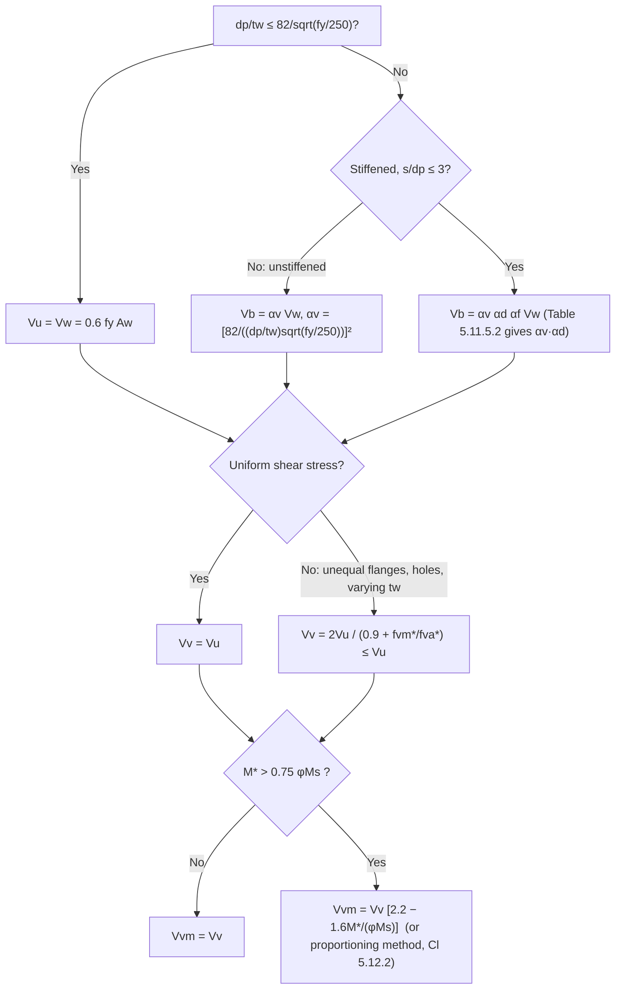

# Web design — arrangement, shear, shear-bending interaction and bearing

> Scope: AS 4100:2020 Cl 5.9–5.13 — web panel definition and minimum
> thickness (unstiffened, transversely stiffened, longitudinally stiffened,
> plastic-hinge webs), openings, shear yield and shear buckling capacity
> (`V_w`, `V_b`, `α_v`, `α_d`, `α_f`, Table 5.11.5.2), shear-bending
> interaction (proportioning and interaction methods), compressive bearing
> on a web edge (`R_by`, `R_bb`, dispersion figures, RHS rules, combined
> bending and bearing of RHS). Appendix I combined-action web panel checks.
> Stiffener design is on [[steel-web-stiffeners]].

## Summary

`[code]` Shear: `V* ≤ φV_v` (Cl 5.11.1), `φ = 0.9`. For a uniform shear
stress distribution `V_v = V_u`, where `V_u = V_w = 0.6 f_y A_w` when
`d_p/t_w ≤ 82/sqrt(f_y/250)`, otherwise `V_u = V_b` (shear buckling,
Cl 5.11.5). CHS: `V_w = 0.36 f_y A_e`.

`[code]` Bearing: `R* ≤ φR_b` with `R_b = min(R_by, R_bb)` (Cl 5.13.2);
`R_by = 1.25 b_bf t_w f_y` (Cl 5.13.3); `R_bb` is a Section 6 column check
of a web strip `t_w × b_b` with `α_b = 0.5`, `k_f = 1.0` and slenderness
`2.5d_1/t_w` (both flanges laterally restrained) or `5.0d_1/t_w` (one
flange) (Cl 5.13.4). Load-bearing stiffeners are required where `R* > φR_b`
(Cl 5.10.2).

## Detail

### Web panel and minimum thickness (Cl 5.9, 5.10)

`[code]` A web panel of thickness `t_w` extends over an unstiffened area with
longitudinal dimension `s` and clear transverse dimension `d_p`, bounded by
flanges, stiffeners or free edges (5.9.2). Minimum thickness (5.9.3) per
Cl 5.10.1, 5.10.4, 5.10.5, 5.10.6 unless rational analysis justifies less.
`d_1` = clear web depth between flanges ignoring fillets/welds.

| Case | Minimum `t_w` | Condition |
|---|---|---|
| Unstiffened, flanges both sides (5.10.1) | `(d_1/180)·sqrt(f_y/250)` | — |
| Unstiffened, one free longitudinal edge (5.10.1) | `(d_1/90)·sqrt(f_y/250)` | — |
| Transversely stiffened (5.10.4) | `(d_1/200)·sqrt(f_y/250)` | `1.0 ≤ s/d_1 ≤ 3.0` |
| | `(s/200)·sqrt(f_y/250)` | `0.74 < s/d_1 ≤ 1.0` |
| | `(d_1/270)·sqrt(f_y/250)` | `s/d_1 ≤ 0.74` |
| Longitudinal stiffener at `0.2d_2` + transverse (5.10.5) | `(d_1/250)·sqrt(f_y/250)` | `1.0 ≤ s/d_1 ≤ 2.4` |
| | `(s/250)·sqrt(f_y/250)` | `0.74 ≤ s/d_1 ≤ 1.0` |
| | `(d_1/340)·sqrt(f_y/250)` | `s/d_1 < 0.74` |
| Second longitudinal stiffener at neutral axis (5.10.5) | `(d_1/400)·sqrt(f_y/250)` | `s/d_1 ≤ 1.5` |
| Web containing a plastic hinge (5.10.6) | `(d_1/82)·sqrt(f_y/250)` | — |

`d_2` = twice the clear distance from the neutral axis to the compression
flange. Web lengths with `s/d_p > 3.0` are treated as unstiffened (`d_p` =
greatest panel depth in the length).

`[code]` **Load bearing stiffeners** (5.10.2) are required where the design
bearing force through a flange exceeds `φR_b` of the web alone, or to form
an end post (5.15.2.2). **Side reinforcing plates** (5.10.3) may augment the
web; account for asymmetry and limit their assumed shear share to what the
fasteners can transmit to web and flanges.

`[code]` **Plastic-hinge webs** (5.10.6): load bearing stiffeners are also
required where a bearing load or shear force acts within `d_1/2` of a
plastic hinge and exceeds `0.1 φV_w`; stiffeners within `d_1/2` either side
of the hinge, designed per Cl 5.14 for the greater of bearing load or
shear force; flat-plate stiffeners must have `λ_s < λ_sp` using `f_ys`.

`[code]` **Openings in webs** (5.10.7): an unstiffened opening is permitted
(not castellated members) if the greatest internal dimension `l_w` satisfies
`l_w/d_1 ≤ 0.10` (no longitudinal stiffeners) or `≤ 0.33` (longitudinally
stiffened), adjacent openings are at least 3 × the greatest opening
dimension apart, and only one unstiffened opening per cross-section
(unless rational analysis). Castellated members and stiffened openings
need rational analysis.

### Shear capacity (Cl 5.11)

`[code]`
- Uniform shear distribution (5.11.2): `V_v = V_u`; `V_u = V_w` if
  `d_p/t_w ≤ 82/sqrt(f_y/250)`, else `V_u = V_b`.
- Non-uniform distribution (5.11.3) — unequal flanges, varying web
  thickness, non-fastener holes: `V_v = 2V_u/[0.9 + (f*_vm/f*_va)] ≤ V_u`,
  with `f*_vm`, `f*_va` = maximum and average design shear stresses from a
  rational elastic analysis. CHS: `V_v = V_w`.
- Shear yield (5.11.4): `V_w = 0.6 f_y A_w` (`A_w` gross web area). CHS:
  `V_w = 0.36 f_y A_e`, `A_e` = gross area if holes are only fastener holes or
  net ≥ 0.9 gross, else net area.
- The flange-to-web connection shear may govern the section shear capacity
  (Note to 5.11.1) — check it for welded girders.

`[code]` **Shear buckling (5.11.5)**:
- Unstiffened web (5.11.5.1): `V_b = α_v V_w ≤ V_w`, `α_v = [82 / ((d_p/t_w)·sqrt(f_y/250))]²`.
- Stiffened web, `s/d_p ≤ 3.0` (5.11.5.2): `V_b = α_v α_d α_f V_w ≤ V_w`
  - `α_v = [82/((d_p/t_w)sqrt(f_y/250))]² · [0.75/(s/d_p)² + 1.0] ≤ 1.0` for `1.0 ≤ s/d_p ≤ 3.0`
  - `α_v = [82/((d_p/t_w)sqrt(f_y/250))]² · [1/(s/d_p)² + 0.75] ≤ 1.0` for `s/d_p ≤ 1.0`
  - `α_d = 1 + (1 − α_v) / [1.15 α_v sqrt(1 + (s/d_p)²)]` (tension field), or 1.0 where Cl 5.15.2.2 requires
  - `α_f = 1.0`, or for webs without longitudinal stiffeners
    `α_f = 1.6 − 0.6 / sqrt[1 + (40 b_fo t_f²/(d_1² t_w))]` with `b_fo` = least of
    `12t_f/sqrt(f_y/250)`, the distance from the web mid-plane to the nearer
    flange edge (0 with no outstand), and half the clear distance between
    webs for multi-web sections; or from a rational buckling analysis.
  - `d_p` = depth of the deepest web panel.

![[as4100-table-5.11.5.2-alpha-v-alpha-d.png]]
*Table 5.11.5.2 — values of α_v·α_d by (d_p/t_w)·sqrt(f_y/250) and s/d_p (AS 4100:2020).*

`[derived]` Hot-rolled UB/UC webs: the deepest common rolled section
(610UB) has `d_1/t_w ≈ 50–55`, well under 82 for Grade 300
(`82/sqrt(1.2) = 74.9`), so `V_v = 0.6 f_y A_w` for all rolled UB/UC/PFC.
Shear buckling matters for welded plate girders and WB sections.

### Shear and bending interaction (Cl 5.12)

`[code]` `V_vm` (web shear capacity in the presence of moment) by either:
- **Proportioning method** (5.12.2): if the flanges alone carry the moment,
  `M* ≤ φM_f` with `M_f = A_fm d_f f_y` (`A_fm` = lesser flange effective
  area — Cl 6.2.2 for compression flange; `min(A_fg, 0.85A_fn f_u/f_y)` for
  the tension flange), then `V_vm = V_v` and `V* ≤ φV_vm`.
- **Interaction method** (5.12.3): whole section carries moment;
  `V_vm = V_v` for `M* ≤ 0.75φM_s`; `V_vm = V_v[2.2 − 1.6M*/(φM_s)]` for
  `0.75φM_s < M* ≤ φM_s`.

`[derived]` At `M* = φM_s` the interaction method gives `V_vm = 0.6V_v`. For
simply supported beams the peak shear and peak moment rarely coincide;
the check bites at continuous supports and at concentrated loads near
supports.

### Bearing on the edge of a web (Cl 5.13)

`[code]` **Dispersion** (5.13.1): a point load or stiff bearing of length
`b_s` disperses at 1:2.5 through the flange to the web face (I-sections) or
to the top of the flat web (RHS/SHS), and at 1:1 through solid material to
the flange; `b_s` is the length that cannot deform appreciably in bending.

![[as4100-fig-5.13.1.1-bearing-dispersion.png]]
*Figure 5.13.1.1 — dispersion of force through flange and web: (a) interior, (b) end force; b_bf = b_s + 5t_f, b_bw = d_2/2 (AS 4100:2020).*

![[as4100-fig-5.13.1.2-stiff-bearing-length.png]]
*Figure 5.13.1.2 — stiff bearing length on flange (AS 4100:2020).*

`[code]` **Bearing yield** (5.13.3): `R_by = 1.25 b_bf t_w f_y`, `b_bf` per
Figure 5.13.1.1 (`= b_s + 5t_f` for an I-section; at an end, only the
available dispersion length counts).

`[code]` **Bearing buckling** (5.13.4), I- or C-section web without
transverse stiffeners: Section 6 axial capacity with `α_b = 0.5`,
`k_f = 1.0`, web area `t_w b_b`, geometrical slenderness `2.5d_1/t_w` (both
flanges restrained against lateral movement out of the web plane) or
`5.0d_1/t_w` (one flange restrained), `b_b` = total bearing width from 1:1
dispersion from `b_bf` to the neutral axis (`b_b = b_bf + 2b_bw` interior,
`b_bf + b_bw + b_o` at an end, `b_bw = d_2/2`).

`[code]` **RHS/SHS to AS/NZS 1163** (5.13.3, 5.13.4, Figure 5.13.1.3):
`R_by = 2 b_b t f_y α_p` for both webs, where
- interior bearing (`b_d ≥ 1.5d_5`): `α_p = (0.5/k_s)[1 + (1 − α_pm²)(1 + k_s/k_v − (1 − α_pm²)·0.25/k_v²)]`,
  `α_pm = 1/k_s + 0.5/k_v`, `k_s = 2r_ext/t − 1`, `k_v = d_5/t`,
  `b_b = b_s + 5r_ext + d_5`;
- end bearing (`b_d < 1.5d_5`): `α_p = sqrt(2 + k_s²) − k_s`,
  `b_b = b_s + 2.5r_ext + d_5/2`;
- `b_d` = distance from stiff bearing to member end, `d_5 = d − 2r_ext` =
  flat web width, `r_ext` = outside corner radius.
- `R_bb`: Section 6 with `α_b = 0.5`, `k_f = 1.0`, area `t_w b_b`,
  slenderness `3.5d_5/t_w` (interior) or `3.8d_5/t_w` (end).

![[as4100-fig-5.13.1.3-rhs-bearing-dispersion.png]]
*Figure 5.13.1.3 — RHS/SHS dispersion of force through flange, radius and web (AS 4100:2020).*

`[code]` **Combined bending and bearing, RHS/SHS** (5.13.5): satisfy Cl 5.2,
5.13.2 and either `1.2(R*/φR_b) + (M*/φM_s) ≤ 1.5` (when `b_s/b ≥ 1.0` and
`d_1/t_w ≤ 30`) or `0.8(R*/φR_b) + (M*/φM_s) ≤ 1.0` otherwise; `b` = total
section width.

### Appendix I — stiffened web panels under combined actions (informative)

`[code]` For a web panel carrying `M*_w`, `V*_w`, `N*_w` and bearing `R*_w`
(Figure I.1):
- **Yield check (I.1)**: `(R*_w/(φ b_bf t_w))² − (f*_w/φ)(R*_w/(φ b_bf t_w)) + (f*_w/φ)² + (V*_w/(0.6φA_w))² ≤ f_y²`
  with `f*_w = N*_w/A_w + 0.77M*_w/Z_we`, `Z_we = t_w d_p²/6`; `M*_w` by
  elastic theory for non-compact/slender flanges or plastic theory for
  compact flanges.
- **Buckling check (I.2)**: `R*_w/(φR_sb) + N*_w/(φN_wo) + (V*_w/(φV_v))² + (M*_w/(φM_w))² ≤ 1`
  with `N_wo = 45A_w f_y / [(d_p/t_w)sqrt(f_y/250)] ≤ A_w f_y`, `V_v` per Cl 5.11,
  `M_w` per Cl 5.2 for the web alone, `R_sb = β_w b_bf t_w f_y`,
  `β_w = 0.10 + 20/[(d_e/t_w)sqrt(f_y/250)]`, `d_e = 1.9 sqrt(b_bf d_p)/α_w`,
  `α_w = [3.4 + 2.2d_p/s][0.4 + 0.5b_bf/s]`.

## Worked reference

None yet.

## Contradictions

None recorded.

## Related

- [[steel-web-stiffeners]] — load bearing stiffeners (Cl 5.14),
  intermediate transverse stiffeners and end posts (Cl 5.15), longitudinal
  stiffeners (Cl 5.16).
- [[steel-beam-section-moment-capacity]] — `M_s` used in Cl 5.12.
- [[steel-compression-member-capacity]] — Section 6 method used for `R_bb`
  and `R_sb`.
- [[steel-connection-design-requirements]] — Cl 9.1.10 hole deductions.
- [[asi-dct-vol1-beam-capacity-tables]] — Part 5.2 design web capacity
  tables (`φV_v`, `φR_bb`/`b_b`, `φR_by`/`b_bf`) for every open section,
  and Table T5.2 (flange-web weld shear capacity for welded sections).

## Sources

- `raw/0-standards/AS_4100-2020-Reprinted-Cut.pdf`, Cl 5.9–5.13
  (pp. 70–81), Appendix I (pp. 200–202). Table 5.11.5.2 and Figures
  5.13.1.1–5.13.1.3 reproduced in `wiki/1-steelwork/assets/`.
