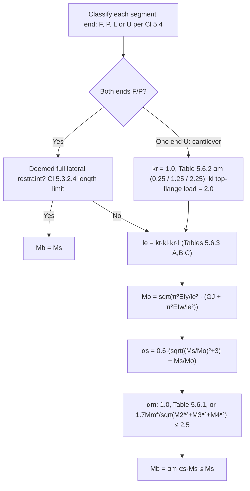

# Beam member moment capacity (lateral-torsional buckling)

> Scope: AS 4100:2020 Cl 5.6 — nominal member moment capacity `M_b` for
> segments without full lateral restraint: `α_m` (Table 5.6.1 / 5.6.2 /
> formula), `α_s`, reference buckling moment `M_o`, effective length
> `l_e = k_t k_l k_r l` (Tables 5.6.3(A)–(C)), varying sections, unequal
> flanges (`β_x`), angles, hollow sections, cantilevers (Cl 5.6.2), design
> by buckling analysis (Cl 5.6.4); Cl 5.7 non-principal-plane bending;
> Appendix H elastic buckling approximations.

## Summary

`[code]` For open sections with equal flanges, fully or partially restrained
at both ends (Cl 5.6.1.1(a)):

`M_b = α_m α_s M_s ≤ M_s` — Eq 5.6.1.1(1)

`α_s = 0.6 · { sqrt[(M_s/M_oa)² + 3] − (M_s/M_oa) }` — Eq 5.6.1.1(2) (A1)

`M_o = sqrt{ (π²EI_y/l_e²) · [GJ + π²EI_w/l_e²] }` — Eq 5.6.1.1(3)

with `M_oa = M_o` (or from a buckling analysis, Cl 5.6.4) and
`l_e = k_t k_l k_r l` (Cl 5.6.3). `φ = 0.9`.

## Detail

### Moment modification factor α_m (Cl 5.6.1.1(a))

`[code]` Take as one of: (i) 1.0; (ii) Table 5.6.1; (iii) the A1-amended
formula

`α_m = 1.7 M*_m / sqrt[(M*_2)² + (M*_3)² + (M*_4)²] ≤ 2.5`

where `M*_m` is the maximum design moment in the segment and `M*_2`, `M*_3`,
`M*_4` are the moments at the quarter, mid and three-quarter points; or
(iv) an elastic buckling analysis (Cl 5.6.4). For sub-segments formed by
intermediate lateral restraints in segments F/P at both ends, use the
**sub-segment** moment distribution.

![[as4100-table-5.6.1-alpha-m-both-ends-restrained.png]]
*Table 5.6.1 — α_m for segments fully or partially restrained at both ends (AS 4100:2020).*

`[code]` Own transcription of Table 5.6.1 (× = F or P restraint; diagrams
show positive force directions):

| Beam segment loading | α_m | Range |
|---|---|---|
| End moments `M` and `β_m M` (linear) | `1.75 + 1.05β_m + 0.3β_m²` | −1 ≤ β_m ≤ 0.6 |
| | 2.5 | 0.6 < β_m ≤ 1 |
| Two equal point loads `F` symmetric, spacing `2a` | `1.0 + 0.35(1 − 2a/l)²` | 0 ≤ 2a/l ≤ 1 |
| Single point load `F` at distance `a` from one end | `1.35 + 0.4(2a/l)²` | 0 ≤ 2a/l ≤ 1 |
| Central point load `F`, one end moment `3β_m Fl/16` | `1.35 + 0.15β_m` | 0 ≤ β_m < 0.9 |
| | `−1.2 + 3.0β_m` | 0.9 ≤ β_m ≤ 1 |
| Central point load `F`, both end moments `β_m Fl/8` | `1.35 + 0.36β_m` | 0 ≤ β_m ≤ 1 |
| UDL `w`, one end moment `β_m wl²/8` | `1.13 + 0.10β_m` | 0 ≤ β_m ≤ 0.7 |
| | `−1.25 + 3.5β_m` | 0.7 ≤ β_m ≤ 1 |
| UDL `w`, both end moments `β_m wl²/12` | `1.13 + 0.12β_m` | 0 ≤ β_m ≤ 0.75 |
| | `−2.38 + 4.8β_m` | 0.75 ≤ β_m ≤ 1 |
| Uniform moment `M` (both ends restrained, fixed-ended shape) | 1.00 | |
| Point load `F` at free-moment end, fixed other end (both ends F/P) | 1.75 | |
| UDL `w`, fixed one end, both ends F/P | 2.50 | |

`[code]` Table 5.6.2 — α_m for segments **unrestrained at one end**
(cantilevers, other end F/P and laterally continuous or rotationally
restrained):

| Loading | α_m |
|---|---|
| Uniform moment `M` | 0.25 |
| Point load `F` at free end | 1.25 |
| UDL `w` | 2.25 |

`[derived]` The Table 5.6.2 values are far below Table 5.6.1's because a
cantilever tip is free to twist and deflect laterally — the "restraint" is
all at the root. A cantilever with a tip lateral restraint is not a
Table 5.6.2 case; treat it as a segment F/P–L per Cl 5.4.2.4 only if the
root is F/P and the tip prevents critical flange deflection.

### Slenderness reduction factor α_s and M_oa (Cl 5.6.1.1(a))

`[code]` `M_oa` is either (A) `M_o` from Eq 5.6.1.1(3), or (B) a value from
an elastic buckling analysis (Cl 5.6.4). `E`, `G` per Cl 1.4 (200 000 and
80 000 MPa); `I_y`, `J`, `I_w` section constants (App H, Cl H.4 gives
approximations).

### Effective length (Cl 5.6.3)

`[code]` `l_e = k_t k_l k_r l`. `l` = the segment length (segments without
intermediate restraints, or segments unrestrained at one end with or
without intermediate restraints) or the sub-segment length (sub-segments
formed by intermediate L restraints in a segment F/P at both ends).
`k_r < 1` only where effective rotational restraints (Cl 5.4.3.4) act at
one or both ends of a segment F/P at both ends; `k_r = 1.0` for all
segments unrestrained at one end.

`[code]` **Table 5.6.3(A) — twist restraint factor k_t**:

| Restraint arrangement | k_t |
|---|---|
| FF, FL, LL, FU | 1.0 |
| FP, PL, PU | `1 + [(d_1/l)(t_f/2t_w)³] / n_w` |
| PP | `1 + [2(d_1/l)(t_f/2t_w)³] / n_w` |

`[code]` **Table 5.6.3(B) — load height factor k_l (gravity loads)**:

| Longitudinal position of load | Restraint arrangement | Shear centre | Top flange |
|---|---|---|---|
| Within segment | FF, FP, FL, PP, PL, LL | 1.0 | 1.4 |
| Within segment | FU, PU | 1.0 | 2.0 |
| At segment end | FF, FP, FL, PP, PL, LL | 1.0 | 1.0 |
| At segment end | FU, PU | 1.0 | 2.0 |

`[code]` **Table 5.6.3(C) — lateral rotation restraint factor k_r**:

| Restraint arrangement | Ends with lateral rotation restraints (Cl 5.4.3.4) | k_r |
|---|---|---|
| FU, PU | Any | 1.0 |
| FF, FP, FL, PP, PL, LL | None | 1.0 |
| FF, FP, PP | One | 0.85 |
| FF, FP, PP | Both | 0.70 |

`d_1` = clear depth between flanges ignoring fillets/welds; `n_w` = number
of webs; `t_f` = critical flange thickness; `t_w` = web thickness; F fully,
P partially, L laterally, U unrestrained — two letters give the two ends.

`[derived]` For a typical rolled UB (`t_f/2t_w ≈ 0.8`, `d_1/l ≈ 0.1`) the PP
`k_t` ≈ 1.10 and FP ≈ 1.05 — small but not negligible. Top-flange loading
of a simply supported beam (`k_l = 1.4`) is the more common and larger
penalty; loads hung from the bottom flange do not get a bonus in AS 4100
(no factor < 1.0) unless a buckling analysis is used.

### Segments of varying cross-section (Cl 5.6.1.1(b))

`[code]` Use Cl 5.6.1.1(a) with either (i) the minimum cross-section
properties; (ii) the critical cross-section properties with `M_oa` reduced
by `α_st = 1.0 − [1.2 r_r (1 − r_s)]`, where `r_r = l_r/l` (stepped) or 0.5
(tapered), `r_s = (A_fm/A_fc)[0.6 + 0.4 d_m/d_c]`, `A_fm`, `A_fc` = flange areas
at minimum and critical sections, `d_m`, `d_c` = depths at those sections,
`l_r` = length over which the section is reduced; or (iii) buckling
analysis (Cl 5.6.4).

### I-sections with unequal flanges (Cl 5.6.1.2)

`[code]` `M_b` per 5.6.1.1(a) but with

`M_o = sqrt(π²EI_y/l_e²) · { sqrt[ GJ + π²EI_w/l_e² + (β_x²/4)(π²EI_y/l_e²) ] + (β_x/2)·sqrt(π²EI_y/l_e²) }`

or by buckling analysis. Monosymmetry constant `β_x = 0.8 d_f [(2I_cy/I_y) − 1]`
(approximation) or the exact integral `β_x = (1/I_x)∫(x²y + y³)dA − 2y_o`.
`β_x` is **positive when the larger flange is in compression**, negative
when the smaller flange is in compression.

### Angles and hollow sections (Cl 5.6.1.3, 5.6.1.4)

`[code]` Angle sections and RHS: Cl 5.6.1.1(a) with `I_w = 0`.

`[derived]` CHS and SHS are not listed because their `M_o` is normally far
above `M_s` (high `J`); AS 4100 does not exempt them explicitly, so a
designer should still show `M_b ≥ M_s` for long, slender RHS members bent
about the major axis — the Cl 5.3.2.4 RHS length limit is the quick screen.

### Segments unrestrained at one end (Cl 5.6.2)

`[code]` For a segment U at one end and at the other end both (a) F or P
and (b) laterally continuous or restrained against lateral rotation:
either (i) Eq 5.6.1.1(1) and (2) with `M_oa = M_o` (Eq 5.6.1.1(3)) and
`α_m` from Table 5.6.2; or (ii) `M_b = α_s M_s ≤ M_s` with
`α_s = 0.6{sqrt[(M_s/M_ob)² + 3] − M_s/M_ob}` and `M_ob` from an elastic
buckling analysis (Cl 5.6.4).

### Design by buckling analysis (Cl 5.6.4)

`[code]` `M_ob` at the most critical section from an elastic
flexural-torsional buckling analysis properly modelling support, restraint
and loading. Then `M_oa = M_ob / α_m`, with `α_m` from Cl 5.6.1.1(a) or
`α_m = M_os/M_oo` where `M_os` is the elastic buckling moment of the
segment F at both ends, unrestrained against lateral rotation and loaded
at the shear centre, and `M_oo` is Eq 5.6.1.1(3) with `l_e = l`.

### Appendix H — elastic resistance to lateral buckling (informative)

`[code]` Second-level approximations for use with Cl 5.6.4.
- **H.2, both ends restrained**: `M_ob = α_m α_l M_o` with
  `α_l = sqrt{1 + [0.4α_m y_L (π²EI_y/l²)/M_o]²} + 0.4α_m y_L (π²EI_y/l²)/M_o`
  where `y_L` = distance of gravity load below the centroid (positive
  below). Alternatively, for `−d_o/2 ≤ y_L ≤ d_o/2`,
  `M_oa = M_o + 0.4α_m y_L (π²EI_y/l²)` (Eq H.2(3)) can be used directly in
  Eq 5.6.1.1(2).
- **H.3, unrestrained at one end**: `M_ob = α_mc α_lc M_o`,
  `α_mc = (C_3 + C_4 K)/[π sqrt(1 + K²)]`,
  `α_lc = 1 + (2y_L K/d_f 2)/sqrt[1 + (2y_L K/d_f 2)²]`, with `K` per H.4(3)
  and `C_3`, `C_4` from Table H.3. Use `C_4 = 0` if the restrained end is
  unrestrained against lateral rotation.

`[code]` Table H.3 — `C_3`, `C_4` for beams unrestrained at one end:

| Loading | C_3 | C_4 |
|---|---|---|
| Uniform moment `M` | 1.6 | 0.8 |
| Point load `F` at tip | 4.0 | 3.7 |
| UDL `w` | 7.0 | 8.0 |

- **H.4, reference buckling moment**: general `M_o` (Eq H.4(1), same as
  Cl 5.6.1.2 form); for `β_x = 0`, `M_o = [π sqrt(EI_y GJ)/l] · sqrt(1 + K²)`
  with `K = sqrt(π²EI_w/(GJl²))`. Section constants (A1):
  `I_w = I_y d_f²/4` (doubly symmetric I); `I_w = I_cy d_f² (1 − I_cy/I_y)`
  (monosymmetric I); `I_w = (b_f³ t_f b_w²/48)(8 − 3b_f t_f b_w²/I_x)`
  (thin-walled channel); `I_w = 0` for angle, tee, narrow rectangle, and
  may be taken as 0 for hollow sections. `J ≈ Σ(bt³/3)` open sections;
  `J ≈ 4A_e²/Σ(b/t)` hollow sections (`A_e` enclosed area).
- **H.5.1, elastic torsional end restraints**: `M_obr = M_ob sqrt[2β_t/(1+β_t)] ≤ M_ob`
  with `β_t ≈ (α_rz l/GJ)/[5(1+K²)]` (both ends restrained), or the
  cantilever forms with 25 or 5 in the denominator and `(1+2K²)/(1+K²)`;
  `α_rz` = torsional restraint stiffness (torque per twist).
- **H.5.2, lateral rotation restraints**: continuity with adjacent segments
  can be represented by an effective length `l_e` used in place of `l` in
  H.4(2)/(3) (References 6, 9); for cantilevers with elastic lateral
  rotation restraint use `C_4r/C_4 = 1.5α_ry l/EI_y / [5 + α_ry l/EI_y] ≤ 1.0`.

### Bending in a non-principal plane (Cl 5.7)

`[code]` Deflections constrained to a non-principal plane by continuous
lateral restraints: determine the restraint forces, then principal-axis
moments from those and the applied forces by rational analysis; satisfy
Cl 8.3.4 (5.7.1). Unconstrained: principal-axis moments by rational
analysis; satisfy Cl 8.3.4 and 8.4.5 (5.7.2).

## Worked reference

`[derived]` Illustrative sequence for a simply supported 410UB54 (Grade 300)
spanning 6 m, UDL applied at top flange through purlins at 1.5 m centres
that provide L restraint (top flange critical): segments = 1.5 m
sub-segments, ends of the whole beam F. Sub-segment code FL (end
sub-segments) / LL (interior): `k_t = 1.0`, `k_l = 1.4` (load within
segment at top flange), `k_r = 1.0` → `l_e = 2.1 m`. `α_m` from the
sub-segment moment distribution (near-linear, `β_m` ≈ +0.6 to +0.9 for the
interior sub-segments, so `α_m ≈ 2.5` cap applies only if `β_m > 0.6`).
Numbers are to be filled from the section tables — this is the procedure,
not a result.

## Contradictions

None recorded. **Flag**: Cl 5.6.1.1's α_m formula (item (a)(iii)),
Eq 5.6.1.1(2) (α_s), and the Cl H.4 `J ≈ 4A_e²/Σ(b/t)` hollow-section
formula are all Amendment-No.-1-amended text; the NCC's current reference
edition of AS 4100:2020 is unamended. The H.4 change is a **correction**
(the pre-A1 text erroneously repeated the monosymmetry-constant `β_x`
integral in place of the hollow-section `J` formula) rather than a
technical change, so the current formula is safe to use regardless. See
[[as-4100-2020-steel-structures]] "NCC compliance trap" for the pre-A1
former wording and when it governs.

## Related

- [[as4100-beam-lateral-restraint]] — F/P/L/U classification and restraint
  forces feeding this page.
- [[as4100-beam-section-moment-capacity]] — `M_s`.
- [[as4100-combined-actions-member-capacity]] — Cl 8.4.4 out-of-plane
  capacity uses `M_bx` from here.
- [[as4100-structural-analysis-methods]] — `M*` including amplification.
- [[asi-design-capacity-tables-vol1-open-sections]] — Part 5.3 design
  member moment capacity tables (no full lateral restraint) by segment
  length.
- [[asi-dct-vol1-beam-capacity-tables]] — full transcription of the Part
  5.1 (max. UDL) and 5.3 (`φM_b` vs `L_e`, `α_m = 1`) tables, cross-checked
  against the Cl 5.6.1.1 elastic buckling formula.

## Sources

- `raw/0-standards/AS_4100-2020-Reprinted-Cut.pdf`, Cl 5.6–5.7 (pp. 62–69),
  Appendix H (pp. 194–199). Table 5.6.1 reproduced in
  `wiki/0-standards/assets/`. Eq 5.6.1.1(2) and the α_m formula carry A1
  amendment tags in the source.
