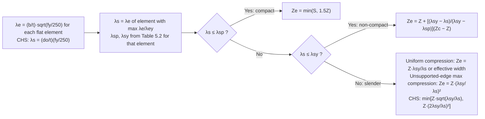

# Beam section moment capacity and section slenderness

> Scope: AS 4100:2020 Cl 5.1 (bending design checks and routing), Cl 5.2
> (nominal section moment capacity `M_s = f_y Z_e`, plate element
> slenderness, Table 5.2 limits, compact / non-compact / slender effective
> section modulus, holes) and Cl 5.3.3 (critical section). Member
> (lateral-torsional) capacity is on [[as4100-beam-member-moment-capacity]].

## Summary

`[code]` Elastic-analysis members bent about the major x-axis must satisfy
both `M*_x ≤ φM_sx` and `M*_x ≤ φM_bx`; about the minor y-axis
`M*_y ≤ φM_sy` (Cl 5.1). `φ = 0.9` (Table 3.4). Plastic-analysis members must
be compact wherever hinges may form, have full lateral restraint (Cl 5.3.2),
satisfy the Cl 5.10.6 web limit, and satisfy `M* ≤ φM_s`.

`[code]` `M_s = f_y Z_e` (Cl 5.2.1) where `Z_e` depends on the section
slenderness class: **compact** `Z_e = min(S, 1.5Z)`; **non-compact**
linear interpolation between `Z` and `Z_c`; **slender** reduced from `Z`
(Cl 5.2.3–5.2.5).

## Detail

### Cl 5.1 routing

`[code]`
- Combined bending and shear → this clause plus Cl 5.12
  ([[as4100-web-shear-and-bearing]]).
- Combined bending with axial compression or tension → Section 8
  ([[as4100-combined-actions-section-capacity]]).
- Deflections constrained to a non-principal plane → analyse per Cl 5.7.1,
  satisfy Cl 8.3.4. Unconstrained, bent about a non-principal axis → Cl 5.7.2,
  satisfy Cl 8.3.4 and 8.4.5.

### Section slenderness (Cl 5.2.2)

`[code]` For flat compression plate elements: `λ_e = (b/t) · sqrt(f_y/250)`
with `b` the clear outstand from the face of the supporting element (one edge
supported) or the clear width between faces of supporting elements (both
edges supported), `t` the element thickness. The **section** slenderness
`λ_s` is the `λ_e` of the element with the largest `λ_e/λ_ey`; `λ_sp` and
`λ_sy` are the `λ_ep`, `λ_ey` of that same element. For CHS:
`λ_s = (d_o/t)(f_y/250)` (note: not square-rooted).

### Table 5.2 — plate element slenderness limits

`[code]` Transcribed from Table 5.2 (AS 4100:2020):

| Plate element type | Longitudinal edges supported | Residual stresses | λ_ep (plasticity) | λ_ey (yield) | λ_ed (deformation) |
|---|---|---|---|---|---|
| Flat, uniform compression | One | SR | 10 | 16 | 35 |
| | | HR | 9 | 16 | 35 |
| | | LW, CF | 8 | 15 | 35 |
| | | HW | 8 | 14 | 35 |
| Flat, max compression at unsupported edge, zero stress or tension at supported edge | One | SR | 10 | 25 | — |
| | | HR | 9 | 25 | — |
| | | LW, CF | 8 | 22 | — |
| | | HW | 8 | 22 | — |
| Flat, uniform compression | Both | SR | 30 | 45 | 90 |
| | | HR | 30 | 45 | 90 |
| | | LW, CF | 30 | 40 | 90 |
| | | HW | 30 | 35 | 90 |
| Flat, compression at one edge, tension at the other | Both | Any | 82 | 115 | — |
| Circular hollow sections | — | SR | 50 | 120 | — |
| | | HR, CF | 50 | 120 | — |
| | | LW | 42 | 120 | — |
| | | HW | 42 | 120 | — |

Key: SR stress relieved; HR hot-rolled or hot-finished; CF cold-formed;
LW lightly welded longitudinally; HW heavily welded longitudinally. Welded
members with compressive residual stresses < 40 MPa may be taken as LW.

`[derived]` Typical assignments: AS/NZS 3679.1 UB/UC/PFC/angles → HR;
AS/NZS 1163 RHS/SHS/CHS → CF; AS/NZS 3679.2 welded beams/columns (WB, WC)
→ HW for the flange outstands (the standard's residual-stress note is the
governing test, and mill data for WB/WC is normally treated as HW).

### Effective section modulus (Cl 5.2.3–5.2.5)

`[code]`
- **Compact** (`λ_s ≤ λ_sp`): `Z_e = min(S, 1.5Z)`.
- **Non-compact** (`λ_sp < λ_s ≤ λ_sy`): `Z_e = Z + [(λ_sy − λ_s)/(λ_sy − λ_sp)](Z_c − Z)`, `Z_c` = compact `Z_e`.
- **Slender** (`λ_s > λ_sy`), flat elements in uniform compression: `Z_e = Z (λ_sy/λ_s)`, or use an effective section omitting from each flat compression element the width in excess of that corresponding to `λ_sy`.
- **Slender**, governed by an element with maximum compression at an unsupported edge and zero/tension at the supported edge: `Z_e = Z (λ_sy/λ_s)²`.
- **Slender CHS**: `Z_e` = lesser of `Z·sqrt(λ_sy/λ_s)` and `Z·(2λ_sy/λ_s)²`.
- Elements with `λ_e > λ_ed` may show noticeable deformation under service loading (serviceability warning, not a strength rule).

### Elastic and plastic section moduli with holes (Cl 5.2.6)

`[code]` Gross section may be used if holes reduce either flange area by no
more than `100·{1 − [f_y/(0.85 f_u)]}` %. Beyond that, use either
`(A_n/A_g)` × gross-section moduli (with `A_n` = net flange areas + gross web
area) or the net section. Hole deductions per Cl 9.1.10.

`[derived]` For Grade 300 plate (f_y = 300, f_u = 430) the threshold is
`100·(1 − 300/365.5) ≈ 18 %` of flange area — a single 22 mm hole in a
150–200 mm flange is usually below this, but two bolt lines in a narrow
flange are not. Compute rather than assume.

### Critical section (Cl 5.3.3)

`[code]` The critical section of a segment is the cross-section with the
largest `M*/M_s`.

### Maximum UDL design tables (practice cross-check)

`[practice]` The ASI *Design Capacity Tables for Structural Steel, Vol 1:
Open Sections* (DCT/V1/03-1999) Part 5 pre-computes, for a simply-supported
single-span beam with full lateral restraint carrying a uniformly
distributed load `W*` (span `L`, self-weight **not** deducted — the
designer must add it to the dead load), the maximum strength-limit-state
load `W*_L = min(W*_L1, W*_L2)` where `W*_L1 = 8φM_sx/L` (moment-governed,
this page's `M_s`) and `W*_L2 = 2φV_v` (shear-governed, see
[[as4100-web-shear-and-bearing]]), and the maximum serviceability load
`W*_S = min(W*_S1, W*_YL)` where `W*_S1` targets a calculated deflection of
`L/250` (`Δ_max = 5WL³/384EI_x`) and `W*_YL` is the first-yield load. This
is a derived convenience layer over the `M_s`/`V_v` capacities on this page
and [[as4100-web-shear-and-bearing]] — not an independent code check. See
[[asi-design-capacity-tables-vol1-open-sections]] for the source register.

![[dct-fig-5.1-beam-configuration.png]]
*DCT Vol 1 Figure 5.1 — beam configuration for the maximum-UDL design
tables: single-span, simply-supported, full lateral restraint, uniformly
distributed load W* (source: DCT/V1/03-1999, p. 5-3).*

## Worked reference

`[derived]` 460UB82.1 Grade 300 (HR): flange `b_f = 191`, `t_f = 16.0`, web
`d_1 = 428`, `t_w = 9.9`, `f_y = 300` (t_f ≤ 17 → 300 per Table 2.1).
Flange outstand `b = (191 − 9.9)/2 = 90.6`; `λ_e = (90.6/16)·sqrt(300/250) = 6.2`,
`λ_ey = 16` → ratio 0.39. Web `λ_e = (428/9.9)·sqrt(1.2) = 47.4`, `λ_ey = 115`
→ ratio 0.41 (governs). Web `λ_ep = 82` → `λ_s = 47.4 < 82` → **compact**,
`Z_e = min(S, 1.5Z)`. Illustrative only — check the section table.

## Contradictions

None recorded.

## Related

- [[as4100-beam-member-moment-capacity]] — `M_b` for segments without full
  lateral restraint; uses `M_s` from this page.
- [[as4100-beam-lateral-restraint]] — when `M_b = M_s` (full lateral
  restraint).
- [[as4100-web-shear-and-bearing]] — shear-bending interaction (Cl 5.12).
- [[as4100-compression-member-capacity]] — the analogous element slenderness
  and form-factor rules for compression (Cl 6.2, Table 6.2.4).
- [[as4100-combined-actions-section-capacity]] — reduced `M_r` with axial load.
- [[as4100-materials-and-design-strengths]] — `f_y` by thickness.
- [[asi-design-capacity-tables-vol1-open-sections]] — maximum-UDL design
  load tables built on this page's `M_s`.
- [[asi-dct-vol1-open-section-properties]] — full transcription of the
  Part 3.1 dimensions/section-property/`Z_e`/`k_f` tables for every open
  section, cross-checked against `φM_sx = 0.9 f_y Z_ex`.
- [[asi-dct-vol1-beam-capacity-tables]] — full transcription of the Part
  5.2 design section moment/web capacity tables.

## Sources

- `raw/0-standards/AS_4100-2020-Reprinted-Cut.pdf`, Cl 5.1–5.2, 5.3.3
  (pp. 53–58).
