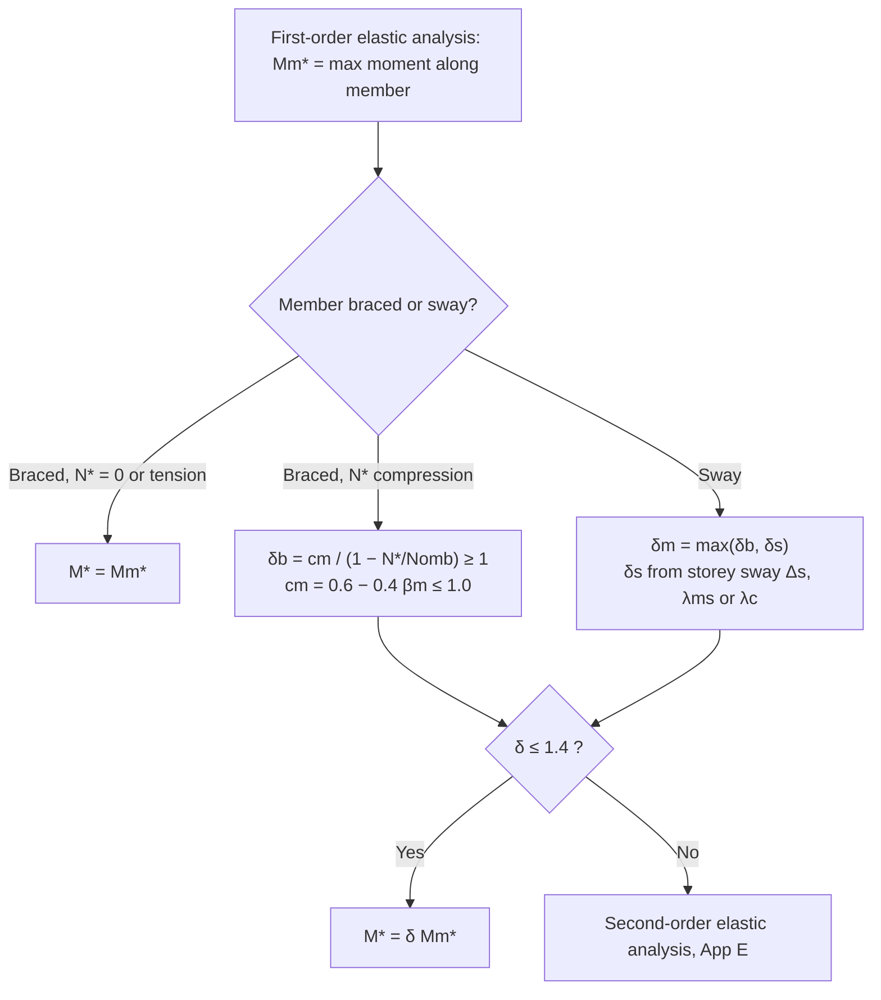

# Steel structural analysis methods and moment amplification

> Scope: AS 4100:2020 Cl 4.1–4.5 and Appendices D, E, F — permitted analysis
> methods, assumed forms of construction, analysis assumptions (span, live
> load patterns, simple construction eccentricities), first-order elastic
> analysis with moment amplification (δ_b, δ_s, c_m, β_m), second-order
> elastic analysis, plastic analysis limits, advanced analysis. Effective
> lengths and frame buckling load factors are on
> [[as4100-member-effective-length-and-frame-buckling]].

## Summary

`[code]` Design action effects are obtained by **elastic analysis (Cl 4.4)**,
**plastic analysis (Cl 4.5)** or **advanced analysis (App D)**, using the
Cl 4.2 form-of-construction assumption and the Cl 4.3 analysis assumptions
(Cl 4.1.1). Earthquake action effects come from AS 1170.4 Section 6
(equivalent static) or Section 7 (dynamic).

`[code]` Second-order effects must be included (Cl 4.4.1.2) — either by
first-order elastic analysis with moment amplification (Cl 4.4.2) provided
`δ_b` and `δ_s` do not exceed 1.4, or by second-order elastic analysis
(App E). If a calculated amplification factor exceeds 1.4, a second-order
analysis is mandatory (Cl 4.4.2.1).

## Detail

### Braced vs sway member (Cl 4.1.2)

`[code]` **Braced member**: transverse displacement of one end relative to the
other is effectively prevented — triangulated frames and trusses, or frames
with in-plane stiffness from diagonal bracing, shear walls, or floor/roof
diaphragms tied to walls or bracing parallel to the buckling plane.
**Sway member**: not so prevented — structures relying on flexural action
to limit sway.

### Forms of construction (Cl 4.2)

`[code]`
- **Rigid** (4.2.2): connections assumed stiff enough to hold the original
  angles between members unchanged.
- **Semi-rigid** (4.2.3): connections may not hold the angles, but are
  assumed to furnish a reliable, known degree of flexural restraint;
  the restraint–load-effect relationship must be established from test
  results.
- **Simple** (4.2.4): end connections assumed to develop no bending moment.
- Connections must be designed consistently with the assumed form and must
  not adversely affect other parts of the structure beyond what is allowed
  for (4.2.5); design per Section 9.

### Analysis assumptions (Cl 4.3)

`[code]`
- Analyse the structure in its entirety, except: regular buildings may be
  treated as parallel 2-D substructures in each of two orthogonal
  directions (unless significant load redistribution between them); for
  vertical load in a braced multi-storey building each level with the
  columns above and below may be a substructure with columns fixed at their
  far ends; floor beams may assume fixity one span beyond the support if the
  beam continues (4.3.1).
- **Span length** = centre-to-centre of supports (4.3.2).
- **Live load arrangements for buildings** (4.3.3): fixed pattern → that
  pattern; variable `Q ≤ 0.75G` → `Q*` on all spans; variable `Q > 0.75G` →
  `Q*` on alternate spans, on two adjacent spans, and on all spans.
- **Simple construction** (4.3.4): bending members connected for shear only
  and free to rotate; triangulated structures may assume all members
  pinned. A beam reaction on a column acts at the greater eccentricity of
  **100 mm from the column face** toward the span or the centre of bearing;
  for a column cap the load acts at the column face (or packing edge). In a
  continuous column the eccentricity moment at a level is ineffective at
  levels above and below, and is split between the column lengths above and
  below in proportion to their `I/l`.

### First-order elastic analysis (Cl 4.4.1, 4.4.2.1)

`[code]` Members assumed elastic for all limit states; haunching or section
variation must be reflected in member stiffness (4.4.1.1). A first-order
analysis ignores geometry change and the axial-force reduction of member
stiffness; these are recovered by amplifying moments per Cl 4.4.2.2 or
4.4.2.3. `M*_m` = maximum moment along the member from superposing the
simple-beam moment of any transverse load on the end moments from the
analysis.

### Moment amplification — braced member (Cl 4.4.2.2)

`[code]` Zero axial force or axial tension: `M* = M*_m`.
Axial compression `N*`:

`M* = δ_b · M*_m`, with `δ_b = c_m / (1 − N*/N_omb) ≥ 1`

where `N_omb` is the elastic buckling load (Cl 4.6.2) for the braced member
about the same axis as `M*`. For end moments only:

`c_m = 0.6 − 0.4 β_m ≤ 1.0`

`β_m` = ratio of smaller to larger end moment, **positive for reverse
curvature**. With transverse load, use the same `c_m` with `β_m` from one of:
(a) `β_m = −1.0` (conservative); (b) matched to the typical distributions in
Figures 4.4.2.2(A)/(B); or (c) `β_m = 1 − 2Δ_ct/Δ_cw` bounded to ±1.0, where
`Δ_ct` is the mid-span deflection under transverse load plus both end
moments and `Δ_cw` is the mid-span deflection under transverse load plus only
those end moments that deflect in the same direction as the transverse load.

![[as4100-fig-4.4.2.2A-beta-m-moment-distributions.png]]
*Figure 4.4.2.2(A) — β_m for typical moment distributions, Part A (AS 4100:2020).*

![[as4100-fig-4.4.2.2B-beta-m-moment-distributions.png]]
*Figure 4.4.2.2(B) — β_m for typical moment distributions, Part B (AS 4100:2020).*

`[code]` Quick-read table of the figure values (own tabulation):

| Loading / end conditions | Curved (UDL) | Kinked (point load) |
|---|---|---|
| Simply supported | −1.0 | −1.0 |
| Fixed both ends, equal hogging `M*` | +0.2 | +0.5 |
| Both ends hogging `M*/2` (span `M*`) | +0.6 | +1.0 |
| One end pinned, other hogging `M*/2` | −0.5 | +0.4 |
| One end pinned, other hogging `M*` | +0.2 | 0 |
| One end pinned, other hogging `M*/2` (span `M*/2`) | +0.2 | +0.5 |
| Cantilever-type, end `M*` with `M*/2` reverse | −0.4 | −0.5 |
| End `M*`, far end `M*` reverse | +0.1 | −0.1 |
| End `M*/2`, far end `M*` | +0.7 | +0.3 |
| Sagging `M*/2` at one end, hogging `M*/2` at other | −0.5 | −0.4 |
| Sagging `M*/2` one end, hogging `M*` other | −0.2 | −0.1 |
| Linear end moments `M*` and `βM*` | β | — |
| Antisymmetric (double curvature, equal `M*`) | — | +1.0 |

`[derived]` The table is a reading aid; the figure governs — use the figure
for the sign convention and shape match.

### Moment amplification — sway member (Cl 4.4.2.3, App F)

`[code]` `M* = δ_m · M*_m` where `δ_m` is the greater of `δ_b` (as a braced
member, Cl 4.4.2.2) and `δ_s`:

(a) Rectangular frames — for all sway columns in a storey, any of:
- (i) `δ_s = 1 / [1 − (Δ_s/h_s)(ΣN*/ΣV*)]` — `Δ_s` = storey drift under the
  design horizontal storey shears `V*`, `h_s` = storey height, sums over all
  columns in the storey;
- (ii) `δ_s = 1 / (1 − 1/λ_ms)` with `λ_ms` per Cl 4.7.2.2; or
- (iii) `δ_s = 1 / (1 − 1/λ_c)` with `λ_c` from a rational buckling analysis
  of the whole frame (Cl 4.7.2).

(b) Non-rectangular frames — `δ_s = 1 / (1 − 1/λ_c)` for the whole frame.

`[code]` **Appendix F alternative** for sway members of rectangular frames:
split first-order end moments `M*_f` into `M*_fb` (frame with sway prevented)
and `M*_fs = M*_f − M*_fb`; where gravity loads do not cause sway, `M*_fb`
may be taken from gravity loads alone and `M*_fs` from transverse loads
alone. Amplified end moments `M*_e = M*_fb + δ_s M*_fs`; `M*_m` from
superposing simple-beam transverse-load moments on `M*_e`; then `M* = M*_m`
(no compression) or `M* = δ_b M*_m` (compression).

### Second-order elastic analysis (App E)

`[code]` Members remain elastic; geometry change under design load and axial
force effects on stiffness are included, except that stiffness change from
axial force may be neglected when the frame `λ_c > 5` (E.1). `M*` = maximum
moment in the member, taken (a) directly from the second-order analysis;
(b) approximately as the greatest element end moment if the member is
subdivided into enough elements; or (c) by amplifying `M*_m` (superposition
of transverse-load simple-beam moments on the second-order end moments
`M*_e`) with `δ_b` from Cl 4.4.2.2 when the member is in compression (E.2).

`[derived]` In STAAD / SAP2000 a P-Delta analysis with members subdivided
into several elements is the common route to satisfy E.2(b); confirm the
software applies both P-Δ (sway) and P-δ (member curvature) effects, or apply
`δ_b` per E.2(c). See the `5-software-fea` pages when they exist.

### Plastic analysis (Cl 4.5)

`[code]` Permitted subject to Cl 4.5.2; action effects must satisfy
equilibrium and boundary conditions (4.5.1). Limitations (4.5.2), unless
adequate ductility and rotation capacity are demonstrated:
(a) specified minimum `f_y ≤ 450 MPa`; (b) stress-strain to AS/NZS 3678 or
3679.1 ensuring redistribution — deemed satisfied by a yield plateau ≥ 6 ×
yield strain, `f_u/f_y ≥ 1.2`, elongation ≥ 15 % (AS 1391) and strain
hardening; (c) hot-formed members; (d) doubly symmetric I-sections;
(e) compact sections per Cl 5.2.3; (f) no impact or fatigue-type
fluctuating loading.

`[code]` Rigid-plastic analysis (4.5.3). Full-strength connections (moment
capacity ≥ member) must not exceed rotation capacity at any hinge;
partial-strength connections must allow all mechanism hinges to form
without exceeding rotation capacity.

`[code]` Second-order effects in plastic analysis (4.5.4): neglect if
`λ_c ≥ 10`; for `5 ≤ λ_c < 10` amplify design load effects by
`δ_p = 0.9 / (1 − 1/λ_c)`; for `λ_c < 5` a second-order plastic analysis is
required.

### Advanced structural analysis (App D)

`[code]` Permitted for frames of compact sections (Cl 5.2.3) with full
lateral restraint (Cl 5.3, 5.4), provided the analysis demonstrably models
that class of frame — including material properties, residual stresses,
geometric imperfections, second-order effects, erection procedure and
foundation interaction (D.1). For earthquake: torsional response, pounding
and strain-rate effects where appropriate. Strength design then reduces to
the Cl 8.3 section capacity check for members and Section 9 for
connections (D.2); AS 1170.4 earthquake loads correspond to first
significant plastic hinge formation.

## Worked reference

None yet.

## Contradictions

None recorded.

## Related

- [[as4100-member-effective-length-and-frame-buckling]] — `N_om`, `k_e`,
  `γ`, `λ_c`, `λ_ms` (Cl 4.6, 4.7, App G) that feed `δ_b` and `δ_s`.
- [[as4100-limit-state-design-basis]] — where analysis sits in the design
  procedure; SLS deflection uses this method with amplification = 1.0.
- [[as4100-combined-actions-member-capacity]] — Cl 8.4 uses the amplified
  `M*` from this page; Cl 8.4.3 plastic-analysis member limits.
- [[as4100-beam-section-moment-capacity]] — compact-section definition
  required for plastic and advanced analysis.
- [[as3600-elastic-analysis-methods]] — AS 3600 counterpart.
- [[asi-design-capacity-tables-vol1-open-sections]] — Part 4 practical
  guide to δ_b/δ_s moment amplification for a hand-calc design (confirms
  Cl 4.4.2 formulas, 1998-vintage clause numbers).

## Sources

- `raw/0-standards/AS_4100-2020-Reprinted-Cut.pdf`, Cl 4.1–4.5 (pp. 38–47),
  Appendices D, E, F (pp. 189–191). Figures 4.4.2.2(A)/(B) reproduced in
  `wiki/0-standards/assets/`.
